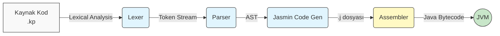
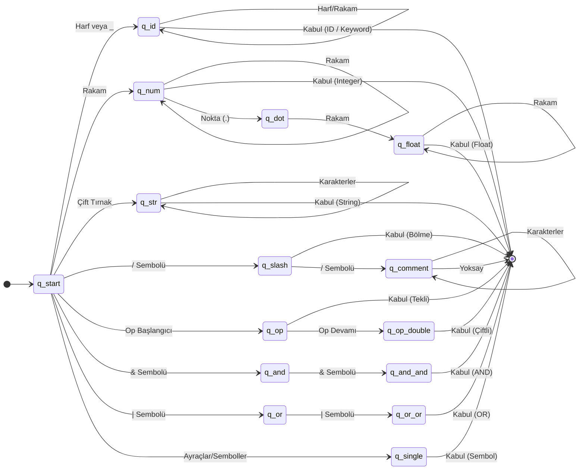

# Krypto Programlama Dili
## Tasarım ve Derleyici Uygulaması

**Hazırlayan:** Erkut
**Bölüm:** Bilgisayar Mühendisliği / Yazılım Mühendisliği

---

# Projenin Temel Amacı

* **Yeni Bir Dil:** Scheme tabanlı, öğrenmesi kolay, C/Java benzeri sözdizimi.
* **Uçtan Uca Derleyici:** Lexer, Parser ve Code Gen. aşamalarından oluşan tam mimari.
* **JVM Hedefi:** Jasmin üzerinden Java Bytecode (`.class`) üreterek JVM'de yerel performans.
* **Güvenlik:** Statik tip çıkarımı ve prosedürel yapı.

---

# Derleyici Akış Diyagramı (Pipeline)



---

# Sözlüksel Analiz (Lexer)

* **Sonlu Durum Makinesi (DFA)** karakterleri okur, anlamsız boşlukları temizler ve **Token**'lara ayırır.



**Örnek:** `let x = 42;` $\rightarrow$ `KEYWORD`, `IDENTIFIER`, `EQUALS`, `INTEGER`, `SEMICOLON`

---

# Sözdizimsel Analiz (Parser) - Gramer

* Token dizisinin **EBNF** gramerine uygunluğunu denetler.
* **Özyinelemeli Aşağı İnişli (Recursive Descent)** ayrıştırma kullanır.

**Örnek Gramer (Değişken Tanımlama):**
```ebnf
letStmt = "let" "mut"? IDENTIFIER ( ":" type )? "=" expression ";" ;
```

**Krypto Kodu:**
```krypto
let mut counter: int = 0;
```

---

# Sözdizimsel Analiz (Parser) - AST 

* Kodun hiyerarşik yapısı için **Soyut Sözdizimi Ağacı (AST)** inşa edilir.
* İşlem öncelikleri **Öncelik Tırmanma (Precedence Climbing)** ile çözülür.

**İfade:** `1 + 2 * 3`

**AST (Scheme Listesi):**
```scheme
(binary-expr add 
(integer 1) 
(binary-expr multiply (integer 2) (integer 3)))
```

---

# Jasmin Ara Kod Üretimi (Code Generation)

* AST düğümlerini okunabilir assembly dili olan **Jasmin (.j)** formatına çevirir.
* JVM **Stack (Yığın)** tabanlıdır; işlemler yığın (push/pop) üzerinden yürütülür.

**Krypto Kodu:**
```krypto
let x = 5 + 3;
```

**Jasmin Assembly:**
```jasmin
ldc 5
ldc 3
iadd
istore_0
```

---

# Java Bytecode ve JVM Yürütme

* Jasmin kodları assembler ile **Java Bytecode (`.class`)** formatına derlenir.
* Krypto programları JVM'de sanal bir `Main` sınıfı olarak çalışır.

**Çalışma Zamanı (Runtime):** 
* Metotlar JVM Stack üzerinde izole *Frame* olarak yürütülür.
* Referanslar Heap'te tutulur ve *Garbage Collector* ile otomatik temizlenir.

---

# Krypto IDE ve Geliştirme Ortamı

* **REPL Desteği:** Etkileşimli kod denemeleri (Read-Eval-Print Loop).
* **Modüler Tasarım:** Bağımsız ve izole test edilebilir derleyici aşamaları.
* **Hata Yönetimi:** Satır/sütun hassasiyetinde konum odaklı geri bildirim.

---

# Sonuç ve Değerlendirme

* **Hedeflere Ulaşıldı:** JVM hedefli, statik tip denetimli tam işlevsel derleyici tamamlandı.
* **Yüksek Performans:** Milisaniyelik derleme hızı ve JVM seviyesinde çalışma performansı.
* **Gelecek Potansiyeli:** Öğrenmesi kolay, akademik eğitime ve geliştirmeye uygun modern mimari.

**Teşekkür Ederim.**
